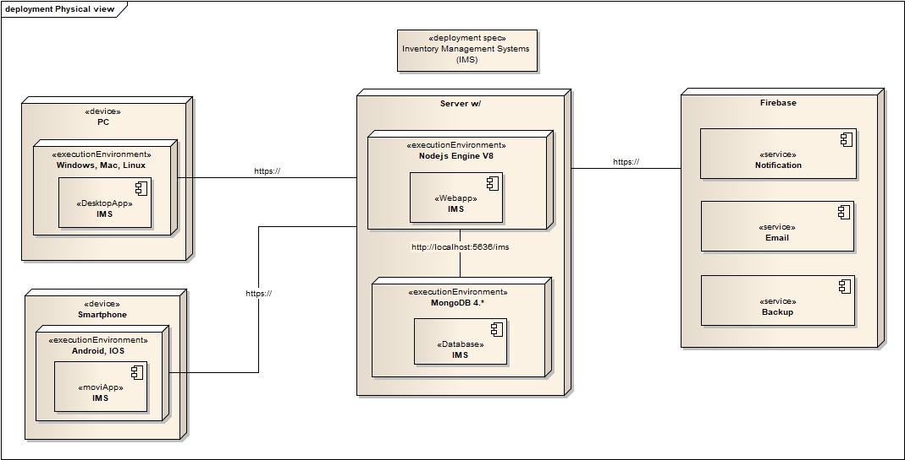
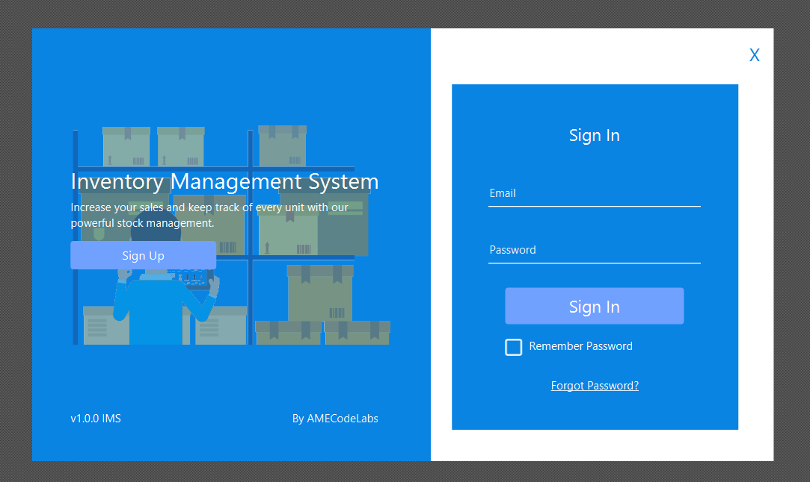
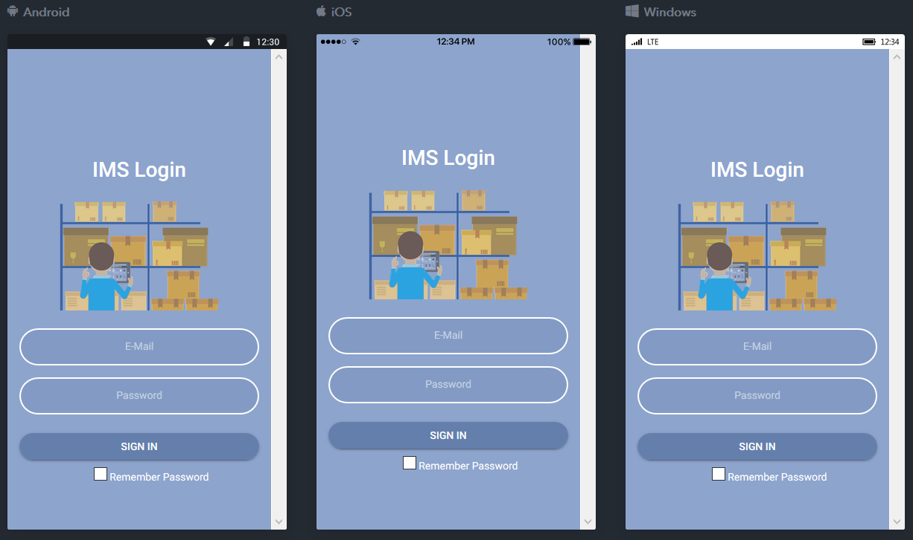
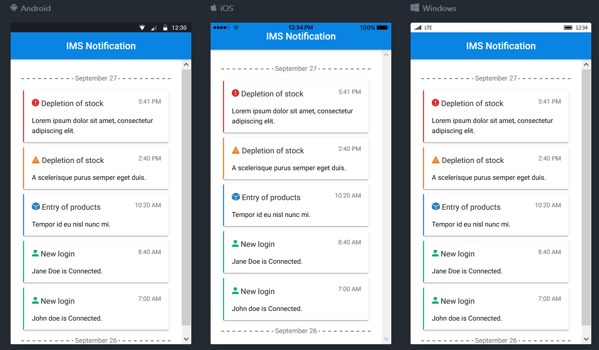

# IMS

> Inventory Managament System

### Deployment view 
<p align="center">
    
</p>

### IMS-Desktop JavaFX
<p align="center">
    
</p>

### IMS-Movil Ionic Framework

<p align="center">
    
    
</p>

### How use/testing

Install dependencies IMS-Service

```console
~/Projects/IMS$ cd IMS-Service
~/Projects/IMS/IMS-Service$ npm install
~/Projects/IMS/IMS-Service$ cd ..
~/Projects/IMS$ docker-compose up
```

### Desktop App - Setup
Windows: [ims-desktop-1.0-windows-x86_64.exe](dist/ims-desktop-1.0-windows-x86_64.exe)
Linux rpm: [ims-desktop-1.0-linux-x86_64.rpm](dist/ims-desktop-1.0-linux-x86_64.rpm)
Linux deb: [ims-desktop-1.0-linux-x86_64.deb](dist/ims-desktop-1.0-linux-x86_64.deb)

### Package Jar
portable: [ims-desktop-1.0-portable-x86_64_jar.zip](dist/ims-desktop-1.0-portable-x86_64_jar.zip)

### Movil App (android)
IMS Notification: [app-debug.apk](dist/app-debug.apk)